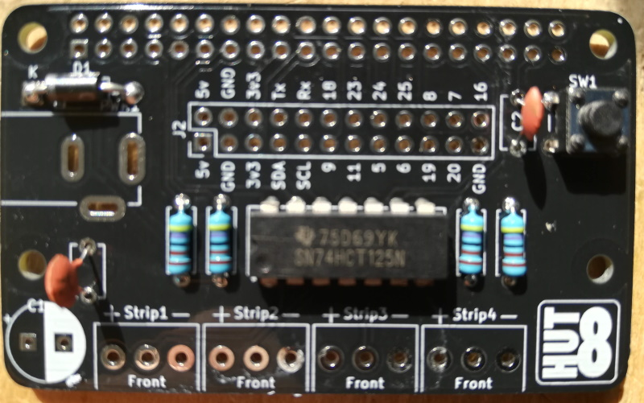

==========================
Building the PixelPi Board
==========================

Components
**********
The PixelPi consists of the following components:

* Four 4.7k Resistors (R1. R2. R3, R4)
* Four screw terminal blocks (Strip1, Strip2, Strip3, Strip4)
* One 1N5817 Schottky Rectifier (D1)
* One 2.1mm barrel jack (PWR1)
* Two 1pF capacitors (C2, C3)
* One 470uF capacitor (C1)
* One button (SW1)
* One 2x40 pin header (J1)
* Optional GPIO Pin breakout pins (J2)
* One PixelPi PCB

Soldering Order
***************
The order you solder the board together does not matter, but doing it in the following order will make it easier.

The PCB
=======
View the PCB from the top and locate the positions of each component.

Resistors (R1. R2. R3, R4)
==========================
The resistors can be soldered either way round, but they look better if they are all the same way round.

Schottky Rectifier
==================
The rectifier (diode) has to be soldered the correct way around. Locate the white band on one end of the diode
and line it up with the white line on the location D1.

The IC Chip
===========

Button
======
The button will only fit one way around at location SW1.

1pF Capacitors (optional, but recommended)
==========================================
The two 1pF capacitors, locations C2 and C3, can be soldered either way around.

Screw Terminals
===============
Connect two pairs of terminals together by sliding the edges together, then solder them onto the board with screw
terminal access holes towards the front of the board.

470uF Capacitor (optional, but recommended)
===========================================
This capacitor has polarity, and therefore has to be soldered the correct way around.
The white area of C1 indicates the -ve leg. The -ve leg is marked with a white line and - symbol.

The Barrel Jack
===============
The last component on the top of the PCB is the barrel jack. This can only fit in one way, with the hole of the barrel
pointing away from the board.

:note: Only use a 5v power supply with the PixelPi board. Anything higher will kill your Raspberry Pi as well as your LEDs.

.. image:: images/build/build_025.jpg
  :width: 800
  :alt: The Barrel Jack

:Note: If you have one of the alpha boards, you will need to solder two pins together due to a small design issue.

Raspberry Pi Header
===================
The Raspberry Pi header should be mounted on the underside of the PCB, soldered from the top.

(Optional) Breakout Headers
===========================
If you plan to use any of the breakout pins, you may solder header pins in place.

