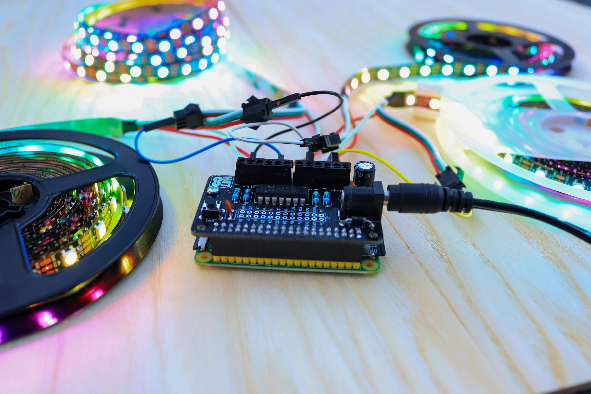

===========
The PixelPi
===========
The PixelPi Library is intended to be used with the PixelPi PCB from Hut 8 Designs.

The PixelPi is a HAT-like add on board from Hut 8 Designs for the Raspberry Pi computer (40-pin versions) and enables you to control
up to four (4) WS281x type RGB LED strips or matrices independently with one Raspberry Pi.

*The PixelPi in action!*

Building the Board
------------------
If you have received the board in kit form you should read :ref:`Building the PixelPi Board` before starting.

Installing the Library
----------------------
Installation instructions are here.