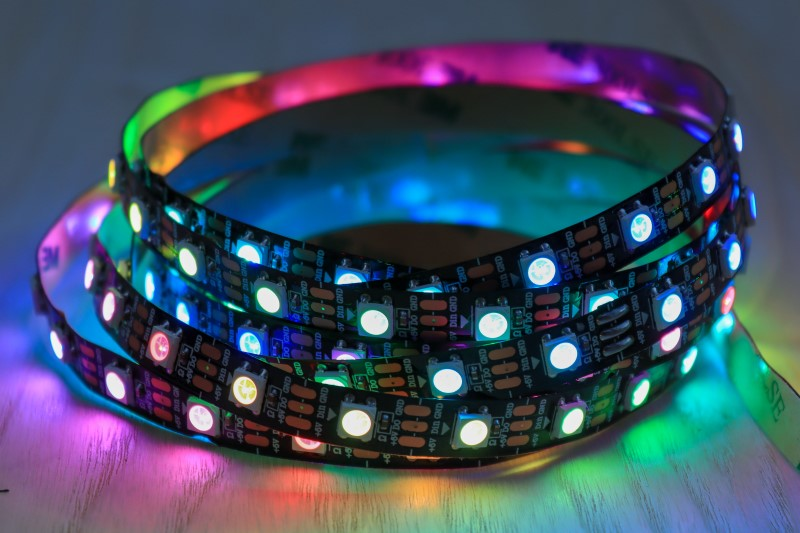
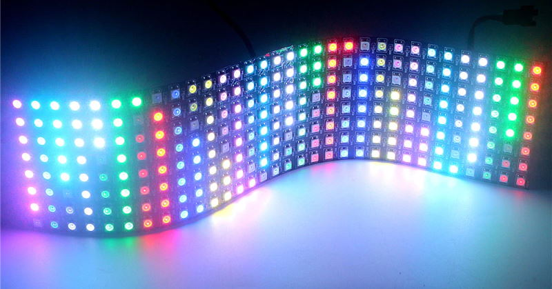

=====================
Identifying LED Types
=====================

When you attach your LEDs you may not know the exact LED type they, and if it is a matrix, you may not know the order of
the LEDs. Sample code has been given to help you identify both LED type and matrix shape.

Connecting the LEDs to the PixelPi board
----------------------------------------
WS281x LEDs have three wires which are usually red, green and white.  The red wire should be connected to + on a
terminal, the white to - and the green to the centre.

Strings and matrices that use the same LED type may be connected together to form longer strings or larger matrices
but you should note that LED brightness will diminish the further away from the start they are.

:Note: Only ever connect a 5v power supply to the PixelPi board. Higher voltage will destroy the board, the Raspberry
  Pi, the LEDs or all three.

Strings and Matrices
--------------------
An LED strip, or string, is a set of LEDs on a long, flexible PCB. They come in many different lengths and LED spacing.

LED matrices are a 2D array of LEDs:

Finding LED Types
-----------------
Once connected to the board, use the following code (in /PixelPiLibrary/examples/string_test.py or
/PixelPiLibrary/examples/matrix_test.py if you are using a matrix):

.. literalinclude:: ../../examples/string_test.py
   :language: python
   :emphasize-lines: 34
   :linenos:

Edit line 34 to set:

 - Which terminal your LEDs are connected to.
 - The number of LEDs in the string (or matrix size, in (width, height) format))
 - The LED type.
 - If you are using a matrix, the ``shape`` must also be set to either ``matrix`` or ``zmatrix``.

To run the code, use the following::

 sudo python3 string_test.py

or::

 sudo python3 matrix_test.py

:Note: ``sudo`` is currently required.

If the LEDs do not display colours in the order RED, GREEN, BLUE followed by a white moving LED you should change the
LED type to one of the following:

  WS2812, SK6812, SK6812W, SK6812_RGBW, SK6812_RBGW, SK6812_GRBW, SK6812_GBRW, SK6812_BRGW, SK6812_BGRW, WS2811_RGB,
  WS2811_RBG, WS2811_GRB, WS2811_GBR, WS2811_BRG, WS2811_BGR

For example, your LEDs may display BLUE, GREEN then all go white. This will not damage them, but indicates you are using
the incorrect type.  Change the type until the colors are displayed in the right order.

For a matrix, the white LED should move in the same direction for each row. If it does not, swap the ``shape`` between
``zmatrix`` and ``matrix``.